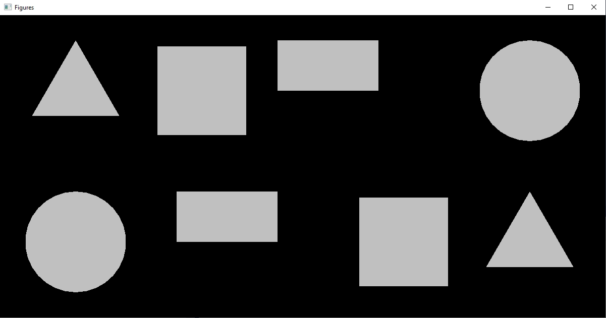
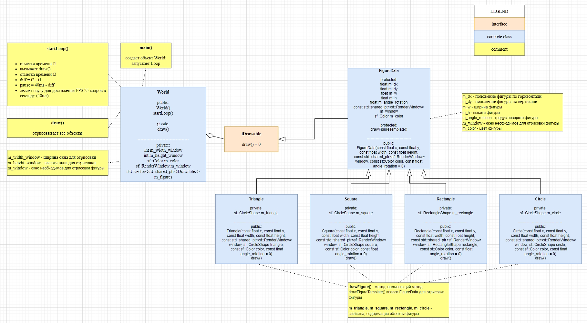

# Figures

## Описание

Программа по выводу геометрических фигур на экран приложения.




## Диаграмма классов (UML)

[diagram.drawio](diagram.drawio) 




## Deploy

```
vcpkg install sfml
vcpkg integrate project
Install-Package vcpkg.C.dev.vcpkg -Source "C:\dev\vcpkg\scripts\buildsystems"
```
