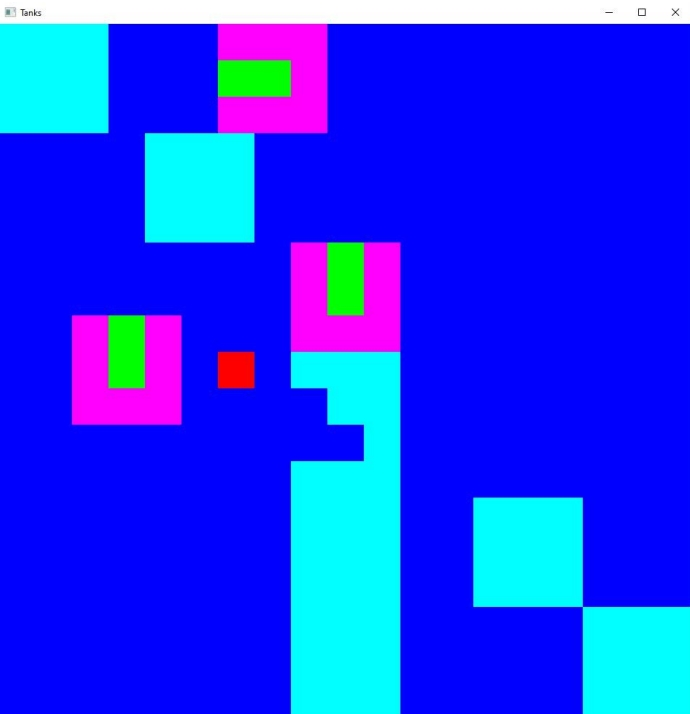

# learning_cpp

Образовательный проект, нацеленный на постепенное развитие в программировании на С++.

## Chat

chat (https://github.com/ProgProgrammer/learning_cpp/tree/main/2021-12-21%201448%20Chat/chat) - проект консольного чата, который состоит из программ сервера и клиентов.

~~~
server.exe
Client #1 connected.
Client #2 connected.

----------------------------------------------------------------

client.exe
Connected.
Welcome to the chat! Press enter twice to start a dialogue.

Enter your name: Vova
Start correspondence:
Hello, Sergey!

        Sergey
        Hello, Vova!

How are you?

        Sergey
        I am fine.

-------------------------------------------------------------------

client.exe
Connected.
Welcome to the chat! Press enter twice to start a dialogue.

        Vova
        Hello, Sergey!

Enter your name: Sergey
Start correspondence:
Hello, Vova!

        Vova
        How are you?

I am fine.
~~~

## Tanks

tanks (https://github.com/ProgProgrammer/learning_cpp/tree/main/2022-05-03%201343%20tanks/tanks) - проект игры "Танки", которая  представляет собой 2D-игру, которая состоит из 3 танков и нескольких препятствий на карте. Все танки могут двигаться корпусом, орудием и стрелять. Управлять можно только 1 танком. Остальные 2 танка двигаются рандомно. Присутствует эффект уничтожения препятствия и танка желтого цвета.

w, s, d, a - перемещение орудия танка; стрелки - перемещение танка; space - стрельба из танка.

